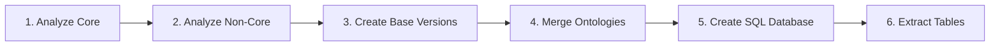

# KBase CDM Ontologies Pipeline

A robust, containerized pipeline for processing and merging biological ontologies at scale with comprehensive version tracking and multi-environment support.

## Overview

This pipeline processes biological ontologies from sources like OBO Foundry, Gene Ontology, CHEBI, and others, creating unified knowledge bases for computational analysis. It transforms heterogeneous ontology formats into structured databases while maintaining provenance and version control.

**Key Capabilities:**
- Processes 30+ major biological ontologies 
- Handles datasets from small (few GB) to massive (>1TB RAM requirements)
- Creates semantic SQL databases for query and analysis
- Exports to multiple formats (OWL, SQLite, TSV, Parquet)
- Comprehensive version tracking with checksums
- Isolated test environments for safe development

## Features

### 🔄 **Intelligent Version Tracking**
- **SHA256 checksums** track actual content changes
- **Automatic backup** of previous versions
- **Skip unchanged downloads** for efficiency
- **Complete audit trail** with timestamps
- **Rollback capabilities** to previous versions

### 🐳 **Multi-Environment Support**
- **Test mode**: 9 curated ontologies for development
- **Production mode**: Full 30+ ontology dataset
- **Docker containers**: Isolated, reproducible environments
- **Kubernetes**: HPC and cloud deployment ready

### ⚡ **Robust Processing**
- **Memory-aware scaling**: 8GB to 1TB+ configurations
- **Retry logic**: Handles network failures gracefully
- **Parallel processing**: Concurrent downloads and analysis
- **Error isolation**: Individual failures don't break pipeline

### 📊 **Rich Output Formats**
- **OWL files**: Standard ontology format
- **SQLite databases**: Queryable semantic structures
- **TSV/Parquet**: Analysis-ready data tables
- **JSON metadata**: Version and provenance tracking

## Quick Start

### 🧪 **Start with Testing (Recommended)**

```bash
# See all available options
./run_test.sh

# Test the complete pipeline with 9 curated ontologies
make test-analyze-core                    # Step 1: Download & analyze
python test_validation.py 1              # Validate step 1
python version_manager.py status         # Check version tracking

# Run complete test workflow
make test-workflow                        # All steps with test data
python test_validation.py all            # Comprehensive validation
```

### 🐳 **Docker Deployment (Production Ready)**

```bash
# Small dataset (development)
make docker-run-small

# Large dataset (production - requires >1TB RAM)
make docker-run-large

# Test dataset (containerized testing)
make docker-test
```

### ⚡ **Native Development**

```bash
# Install dependencies
make install

# Run with custom configuration
ENV_FILE=.env.small make run-workflow

# Individual pipeline steps
make analyze-core      # Download and analyze ontologies
make merge            # Merge into unified files
make create-db        # Generate SQLite databases
make extract-tables   # Export to TSV/Parquet
```

## Installation

### Prerequisites

**For Docker Deployment (Recommended):**
- Docker Engine 20.10+
- Docker Compose v2.0+
- 8GB+ RAM (test mode) or 1TB+ RAM (full production)

**For Native Development:**
- Python 3.10+
- Java 17+ (for ROBOT and relation-graph tools)
- Make
- 16GB+ RAM minimum

### Quick Setup

```bash
# Clone and enter repository
git clone <repository-url>
cd KBase_CDM_Ontologies

# Option 1: Docker (simplest)
make docker-build

# Option 2: Native setup
make install                    # Install Python dependencies
# Note: External tools (ROBOT, relation-graph) auto-installed in Docker
```

### External Tool Dependencies

The pipeline requires several specialized tools, **automatically installed in Docker**:

- **ROBOT v1.9.0**: Ontology manipulation and merging
- **relation-graph v2.3.1**: Relationship materialization  
- **SemanticSQL**: OWL to SQLite conversion

For native installation, see [docs/DEPLOYMENT.md](docs/DEPLOYMENT.md).

## Pipeline Architecture

The CDM Ontologies Pipeline consists of 6 main processing steps:



### Step Details

1. **Analyze Core Ontologies**: Downloads and analyzes primary ontologies from curated sources
2. **Analyze Non-Core Ontologies**: Processes additional ontologies based on dependency analysis
3. **Create Pseudo-Base Versions**: Uses ROBOT to create base versions by removing external axioms
4. **Merge Ontologies**: Combines all ontologies into unified OWL files using ROBOT
5. **Create Semantic SQL Database**: Converts merged OWL to queryable SQLite using SemanticSQL
6. **Extract Tables**: Exports database tables to TSV and Parquet formats for analysis

## Usage Patterns

### 🧪 **Development & Testing**

```bash
# Test with curated 9-ontology subset
make test-workflow

# Run individual steps for debugging
make test-analyze-core
python test_validation.py 1
python version_manager.py status

# Test in Docker environment
make docker-test
```

### 🚀 **Production Deployment**

```bash
# Full pipeline with large datasets
ENV_FILE=.env.large make run-workflow

# Docker production deployment
make docker-run-large

# Kubernetes deployment
kubectl apply -f k8s/
```

### 🔄 **Version Management**

```bash
# Check current ontology versions
python version_manager.py status

# Validate file integrity
python version_manager.py validate

# View download history
python version_manager.py history

# Clean old backups
python version_manager.py clean --keep 3
```

## Configuration

### Environment Profiles

Three pre-configured profiles for different use cases:

| Profile | RAM | Ontologies | Use Case |
|---------|-----|------------|----------|
| `.env.test` | 8GB | 9 curated | Development & testing |
| `.env.small` | 16GB | Limited subset | Local development |
| `.env.large` | 900GB+ | All 30+ | Production deployment |

### Key Configuration Variables

```bash
# Memory Management
ROBOT_JAVA_ARGS=-Xmx32g           # Java heap size for ROBOT
_JAVA_OPTIONS=-Xmx32g             # Global Java memory limit

# Dataset Control  
ONTOLOGIES_SOURCE_FILE=ontologies_source_test.txt  # Source ontology list
DATASET_SIZE=test|small|large     # Predefined size configurations

# Processing Options
ENABLE_REASONING=true|false       # Enable ontological reasoning
ENABLE_MATERIALIZATION=true|false # Materialize inferred relationships
MAX_ONTOLOGY_SIZE_MB=1000         # Size limit for individual ontologies

# Performance Tuning
PARALLEL_DOWNLOADS=10             # Concurrent download threads
BATCH_SIZE=100                    # Processing batch size
```

### Directory Structure

```
KBase_CDM_Ontologies/
├── ontology_data_owl[_test]/        # Downloaded ontology files
│   └── non-base-ontologies/         # Additional ontologies
├── outputs[_test]/                  # Pipeline outputs
│   ├── *.owl                        # Merged ontologies
│   ├── *.db                         # SQLite databases  
│   └── tsv_tables_*/                # Exported data tables
├── ontology_versions[_test]/        # Version tracking
│   ├── ontology_versions.json      # Master version registry
│   ├── download_history.log        # Audit trail
│   └── backups/                     # Previous versions
└── logs/                            # Pipeline execution logs
```

## Version Tracking System

### How It Works

The pipeline includes a sophisticated version tracking system:

- **SHA256 Checksums**: Detect actual content changes, not just timestamp updates
- **Automatic Backups**: Previous versions saved before updates
- **Skip Unchanged**: Avoid re-downloading identical files
- **Audit Trail**: Complete history of all download attempts
- **Integrity Validation**: Verify file corruption or tampering

### Version Files

```bash
# Check what versions you have
python version_manager.py status

# Validate file integrity  
python version_manager.py validate

# View complete download history
python version_manager.py history

# Generate detailed report
python version_manager.py report
```

### Version Information

Each tracked ontology includes:
- Current and previous checksums
- Download timestamp and source URL
- File size and validation status
- Complete version history

## Troubleshooting

### Common Issues

**Out of Memory Errors**
```bash
# Increase Java heap size
export ROBOT_JAVA_ARGS="-Xmx64g"
# Or use smaller dataset
ENV_FILE=.env.small make run-workflow
```

**Network Timeouts**
```bash
# The pipeline automatically retries with exponential backoff
# Check download history for retry attempts
python version_manager.py history
```

**Permission Issues (Docker)**
```bash
# Ensure mounted volumes have correct permissions
chmod -R 755 outputs/ ontology_data_owl/
```

**Tool Not Found (Native)**
```bash
# Use Docker deployment to avoid tool installation issues
make docker-build
make docker-run-small
```

## Workflow Steps

1. **Analyze Core Ontologies**: Download and analyze primary ontologies
2. **Analyze Non-Core Ontologies**: Process additional OBO Foundry ontologies
3. **Create Pseudo-Base**: Generate base versions by removing external axioms
4. **Merge Ontologies**: Combine multiple ontologies using ROBOT
5. **Create Semantic SQL DB**: Convert to SQLite format with SemanticSQL
6. **Extract Tables**: Export database tables to TSV/Parquet formats

## Troubleshooting

### Out of Memory Errors

Adjust Java heap size in your `.env` file:
```bash
ROBOT_JAVA_ARGS=-Xmx16g  # Increase based on available RAM
```

### Permission Issues

The container runs as non-root user `ontology`. Ensure mounted volumes have appropriate permissions:
```bash
chmod -R 777 outputs/  # Or use proper user/group ownership
```

### Missing Tools

All required tools are pre-installed in the container:
- ROBOT v1.9.0
- relation-graph v2.3.1
- SemanticSQL (via pip)

## Development

### Project Structure

```
KBase_CDM_Ontologies/
 cdm_ontologies/      # Python CLI module
 scripts/             # Processing scripts
 notebooks/           # Jupyter notebooks
 k8s/                 # Kubernetes manifests
 outputs/             # Generated files
 ontology_data_owl/   # Downloaded ontologies
 Dockerfile           # Container definition
 docker-compose.yml   # Local orchestration
 Makefile            # Build automation
 requirements.txt    # Python dependencies
```

### Adding New Ontologies

1. Add to `ontologies_source.txt` for core ontologies
2. Modify filters in `analyze_non_core_ontologies.py` for additional sources
3. Update merge list in `ontologies_merged.txt`

## CLI Reference

### Make Commands

```bash
# Workflow Commands
make run-workflow           # Complete pipeline (production)
make test-workflow          # Complete pipeline (test dataset)

# Individual Steps
make analyze-core           # Download and analyze ontologies
make analyze-non-core       # Process dependency ontologies
make create-base           # Generate base versions
make merge                 # Merge into unified files
make create-db             # Create SQLite databases
make extract-tables        # Export to TSV/Parquet

# Docker Commands
make docker-build          # Build container image
make docker-run-small      # Run with small dataset
make docker-run-large      # Run with large dataset  
make docker-test           # Run with test dataset

# Utility Commands
make setup                 # Create directories
make install               # Install Python deps
make clean                 # Clean outputs
make clean-all             # Clean everything
```

### Python CLI

```bash
# Direct CLI usage
python -m cdm_ontologies run-all           # Complete workflow
python -m cdm_ontologies analyze-core      # Individual steps
python -m cdm_ontologies --verbose         # Verbose logging

# Version management
python version_manager.py status           # Current versions
python version_manager.py validate         # Check integrity
python version_manager.py history          # Download log
python version_manager.py clean            # Cleanup backups

# Validation
python test_validation.py all              # Complete validation
python test_validation.py 1                # Validate step 1
python test_validation.py version          # Check version tracking
```

## Documentation

Comprehensive documentation is available in the `docs/` directory:

- **[Getting Started](docs/GETTING_STARTED.md)**: Step-by-step tutorial
- **[Version Tracking](docs/VERSION_TRACKING.md)**: Version management guide
- **[Deployment](docs/DEPLOYMENT.md)**: Production deployment
- **[Architecture](docs/PIPELINE_ARCHITECTURE.md)**: Technical details
- **[Configuration](docs/CONFIGURATION.md)**: Advanced configuration
- **[API Reference](docs/API_REFERENCE.md)**: Complete command reference
- **[Troubleshooting](docs/TROUBLESHOOTING.md)**: Common issues and solutions

## Contributing

1. **Fork** the repository
2. **Create** a feature branch (`git checkout -b feature/amazing-feature`)
3. **Test** your changes with the test dataset (`make test-workflow`)
4. **Commit** your changes (`git commit -m 'Add amazing feature'`)
5. **Push** to the branch (`git push origin feature/amazing-feature`)
6. **Open** a Pull Request

### Development Workflow

```bash
# Setup development environment
make install
make setup

# Test changes
make test-workflow
python test_validation.py all

# Run with different configurations
ENV_FILE=.env.test make run-workflow
ENV_FILE=.env.small make run-workflow
```

## License

TBD - Please specify license for this project.

## Support and Issues

- **GitHub Issues**: Report bugs and request features
- **Documentation**: Check `docs/` directory for detailed guides
- **Logs**: Review `logs/cdm_ontologies.log` for execution details
- **Version History**: Use `python version_manager.py history` for download issues

---

**Built with ❤️ for the scientific community by the KBase team.**