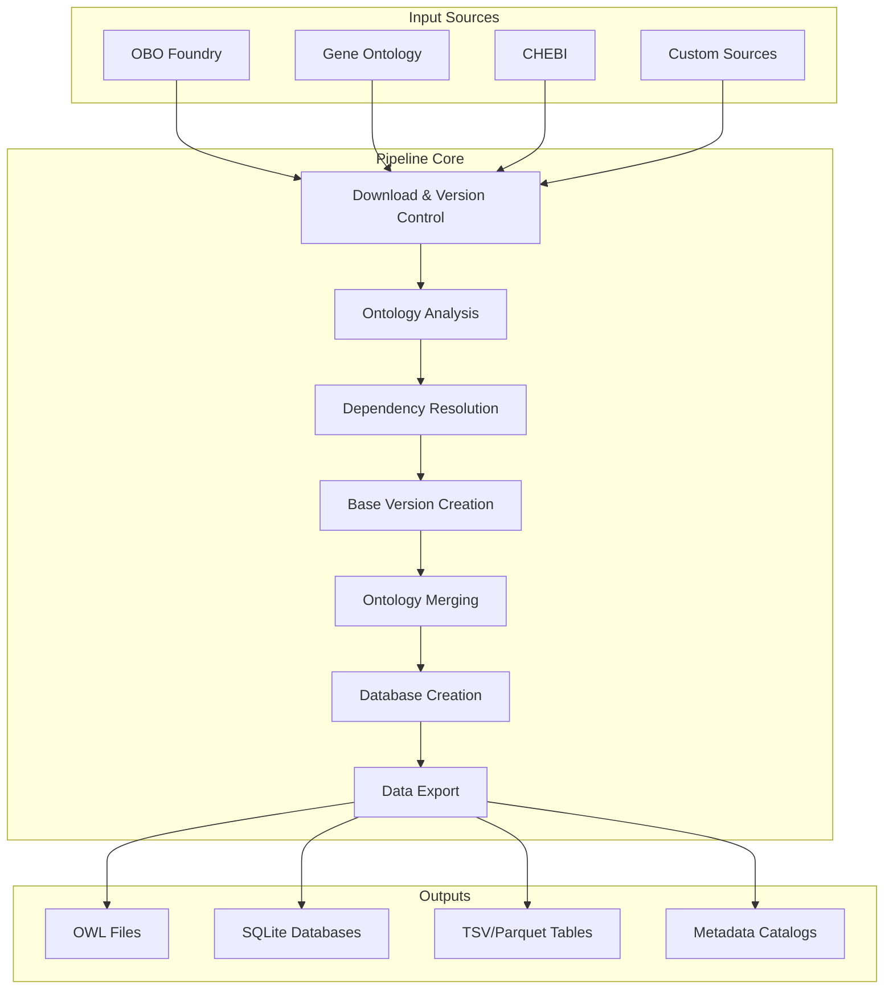
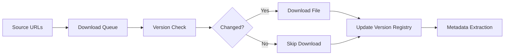
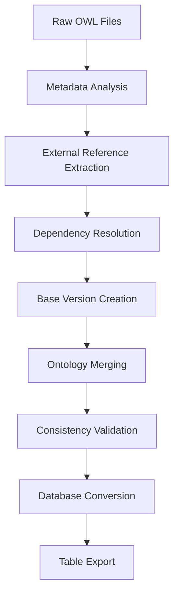
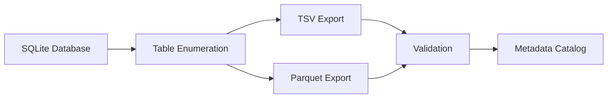

# Pipeline Architecture

This document provides a detailed technical overview of the CDM Ontologies Pipeline architecture, data flow, and component interactions.

## System Overview

The CDM Ontologies Pipeline is a multi-stage processing system that transforms heterogeneous biological ontologies into unified, queryable knowledge bases.



## Pipeline Stages

### Stage 1: Core Ontology Analysis

**Purpose**: Download and analyze primary ontologies
**Input**: Ontology source URLs
**Output**: Downloaded OWL files + metadata

```python
# Core functionality
def analyze_core_ontologies(repo_path):
    ontologies = load_ontology_list()
    
    for ontology in ontologies:
        # Download with version tracking
        download_result = download_with_version_tracking(ontology.url)
        
        # Extract metadata
        metadata = extract_ontology_metadata(ontology.file)
        
        # Analyze external references
        external_refs = find_external_references(ontology.file)
        
        # Store analysis results
        store_analysis_results(ontology.id, metadata, external_refs)
```

**Key Components**:
- `enhanced_download.py`: Version-aware download system
- `version_tracker.py`: SHA256-based change detection
- `analyze_core_ontologies.py`: Metadata extraction and analysis

### Stage 2: Non-Core Ontology Analysis

**Purpose**: Identify and process dependency ontologies
**Input**: Core ontology external references
**Output**: Additional OWL files for dependencies

```python
def analyze_non_core_ontologies():
    # Load external references from core analysis
    external_refs = load_external_references()
    
    # Filter and prioritize dependencies
    candidates = filter_dependency_candidates(external_refs)
    
    # Download missing dependencies
    for candidate in candidates:
        if not already_downloaded(candidate):
            download_ontology(candidate)
```

**Dependency Resolution Algorithm**:
1. Parse external references from core ontologies
2. Filter by OBO Foundry membership
3. Exclude problematic or deprecated ontologies
4. Download missing dependencies

### Stage 3: Pseudo-Base Creation

**Purpose**: Create base versions by removing external axioms
**Input**: Downloaded OWL files
**Output**: Base versions with only native content

```bash
# ROBOT command for base creation
robot remove \
    --input ${ontology}.owl \
    --select "imports external-axioms" \
    --output ${ontology}-base.owl
```

**Process**:
1. Identify external axioms using ROBOT
2. Remove external content while preserving structure
3. Maintain internal consistency
4. Validate resulting base ontology

### Stage 4: Ontology Merging

**Purpose**: Combine multiple ontologies into unified files
**Input**: Base and full ontology versions
**Output**: Merged OWL files

```python
def merge_ontologies():
    # Load merge configuration
    merge_config = load_merge_config()
    
    # Process each merge group
    for group in merge_config.groups:
        ontology_files = [f"{ont}.owl" for ont in group.ontologies]
        
        # Use ROBOT to merge
        robot_merge(
            input_files=ontology_files,
            output_file=f"{group.name}_merged.owl",
            collapse_imports=True
        )
```

**Merging Strategy**:
- **Incremental**: Add ontologies one by one
- **Import Resolution**: Handle import statements
- **Axiom Deduplication**: Remove duplicate axioms
- **Consistency Checking**: Validate merged result

### Stage 5: Semantic SQL Database Creation

**Purpose**: Convert OWL to queryable SQLite format
**Input**: Merged OWL files
**Output**: SQLite databases with semantic structure

```python
def create_semantic_database(owl_file, db_file):
    # Use SemanticSQL for conversion
    command = [
        "semsql",
        "create",
        "--input", owl_file,
        "--output", db_file,
        "--materialize-views"
    ]
    
    subprocess.run(command, check=True)
```

**Database Schema**:
- **Entities**: Classes, properties, individuals
- **Relationships**: Hierarchical and semantic relations
- **Annotations**: Labels, definitions, metadata
- **Materialized Views**: Pre-computed queries

### Stage 6: Data Export

**Purpose**: Export structured data for analysis
**Input**: SQLite databases
**Output**: TSV and Parquet files

```python
def export_tables(db_file, output_dir):
    conn = sqlite3.connect(db_file)
    
    # Get all table names
    tables = get_table_names(conn)
    
    for table in tables:
        # Export to TSV
        export_to_tsv(conn, table, f"{output_dir}/{table}.tsv")
        
        # Export to Parquet for analytics
        export_to_parquet(conn, table, f"{output_dir}/{table}.parquet")
```

## Component Architecture

### Core Components

#### Version Tracking System

```python
class VersionTracker:
    def __init__(self, version_file):
        self.version_file = version_file
        self.versions = self.load_versions()
    
    def check_for_updates(self, url, local_file):
        # Calculate checksums and compare
        current_checksum = self.get_checksum(local_file)
        remote_checksum = self.get_remote_checksum(url)
        
        return current_checksum != remote_checksum
    
    def create_backup(self, file_path):
        # Create timestamped backup
        backup_path = f"{file_path}.{timestamp}.backup"
        shutil.copy2(file_path, backup_path)
        self.log_backup(file_path, backup_path)
```

#### Download System

```python
class EnhancedDownloader:
    def __init__(self, max_retries=3, timeout=30):
        self.max_retries = max_retries
        self.timeout = timeout
        self.version_tracker = VersionTracker()
    
    def download_with_retry(self, url, output_path):
        for attempt in range(self.max_retries):
            try:
                response = requests.get(url, timeout=self.timeout)
                response.raise_for_status()
                
                # Save and update version tracking
                self.save_file(response.content, output_path)
                self.version_tracker.update(url, output_path)
                
                return True
            except Exception as e:
                if attempt < self.max_retries - 1:
                    wait_time = 2 ** attempt
                    time.sleep(wait_time)
                else:
                    raise e
```

#### CLI Interface

```python
class CDMOntologiesCLI:
    def __init__(self):
        self.parser = self.create_parser()
    
    def create_parser(self):
        parser = argparse.ArgumentParser(
            description="CDM Ontologies Pipeline"
        )
        
        subparsers = parser.add_subparsers(dest='command')
        
        # Add subcommands
        self.add_workflow_commands(subparsers)
        self.add_analysis_commands(subparsers)
        self.add_utility_commands(subparsers)
        
        return parser
    
    def run(self):
        args = self.parser.parse_args()
        
        # Route to appropriate handler
        handler = getattr(self, f"handle_{args.command}")
        handler(args)
```

### Configuration Management

#### Environment Detection

```python
def detect_environment():
    """Detect test vs production environment"""
    source_file = os.getenv('ONTOLOGIES_SOURCE_FILE', 'config/ontologies_source.txt')
    
    if 'test' in source_file:
        return {
            'mode': 'test',
            'data_dir': 'ontology_data_owl_test',
            'output_dir': 'outputs_test',
            'version_dir': 'ontology_versions_test'
        }
    else:
        return {
            'mode': 'production',
            'data_dir': 'ontology_data_owl',
            'output_dir': 'outputs',
            'version_dir': 'ontology_versions'
        }
```

#### Memory Management

```python
class MemoryManager:
    def __init__(self):
        self.total_memory = psutil.virtual_memory().total
        self.java_heap_size = self.calculate_java_heap()
    
    def calculate_java_heap(self):
        # Reserve 20% for system, use 80% for Java
        available = self.total_memory * 0.8
        return f"-Xmx{int(available / 1024**3)}g"
    
    def monitor_usage(self):
        # Track memory usage during pipeline
        while self.pipeline_running:
            memory_percent = psutil.virtual_memory().percent
            if memory_percent > 90:
                self.log_warning("High memory usage detected")
            time.sleep(60)
```

## Data Flow

### Input Processing



### Transformation Pipeline



### Output Generation



## Error Handling and Recovery

### Resilience Strategies

1. **Graceful Degradation**: Continue pipeline on individual failures
2. **Automatic Retry**: Exponential backoff for network issues
3. **Checkpoint Recovery**: Resume from last successful stage
4. **Validation Gates**: Verify outputs before proceeding

### Error Classification

```python
class PipelineError(Exception):
    """Base class for pipeline errors"""
    pass

class DownloadError(PipelineError):
    """Network or download-related errors"""
    pass

class ProcessingError(PipelineError):
    """Ontology processing errors"""
    pass

class ValidationError(PipelineError):
    """Output validation errors"""
    pass
```

### Recovery Mechanisms

```python
def run_pipeline_with_recovery():
    checkpoint_file = "pipeline_checkpoint.json"
    
    try:
        # Load previous checkpoint if exists
        checkpoint = load_checkpoint(checkpoint_file)
        start_stage = checkpoint.get('last_completed_stage', 0)
        
        # Resume from checkpoint
        for stage in range(start_stage, len(PIPELINE_STAGES)):
            try:
                run_stage(PIPELINE_STAGES[stage])
                save_checkpoint(checkpoint_file, stage)
            except Exception as e:
                log_error(f"Stage {stage} failed: {e}")
                if is_critical_error(e):
                    raise
                else:
                    continue
                    
    except Exception as e:
        log_error(f"Pipeline failed: {e}")
        raise
```

## Performance Characteristics

### Scalability Metrics

| Dataset Size | Processing Time | Memory Usage | Storage Required |
|--------------|----------------|--------------|------------------|
| Test (9 ontologies) | 10-15 minutes | 8GB | 50GB |
| Small (15 ontologies) | 30-45 minutes | 32GB | 100GB |
| Large (30+ ontologies) | 4-8 hours | 1TB+ | 500GB+ |

### Optimization Strategies

#### Parallel Processing

```python
def parallel_download(urls):
    with ThreadPoolExecutor(max_workers=10) as executor:
        futures = [executor.submit(download_ontology, url) for url in urls]
        
        for future in as_completed(futures):
            try:
                result = future.result()
                log_success(f"Downloaded: {result.filename}")
            except Exception as e:
                log_error(f"Download failed: {e}")
```

#### Memory Optimization

```python
def optimize_memory_usage():
    # Use streaming for large files
    def stream_process_owl(file_path):
        with open(file_path, 'r') as f:
            for line in f:
                yield process_owl_line(line)
    
    # Implement garbage collection hints
    def cleanup_after_stage():
        gc.collect()
        if hasattr(gc, 'set_threshold'):
            gc.set_threshold(0)  # Force cleanup
```

## Extension Points

### Custom Ontology Sources

```python
class CustomOntologySource:
    def __init__(self, name, base_url, list_endpoint):
        self.name = name
        self.base_url = base_url
        self.list_endpoint = list_endpoint
    
    def get_ontology_list(self):
        # Implement custom discovery logic
        response = requests.get(f"{self.base_url}/{self.list_endpoint}")
        return self.parse_ontology_list(response.json())
    
    def download_ontology(self, ontology_id):
        # Implement custom download logic
        url = f"{self.base_url}/ontologies/{ontology_id}.owl"
        return download_file(url)
```

### Custom Processing Steps

```python
class CustomProcessingStep:
    def __init__(self, name, dependencies):
        self.name = name
        self.dependencies = dependencies
    
    def can_run(self, completed_steps):
        return all(dep in completed_steps for dep in self.dependencies)
    
    def execute(self, context):
        # Implement custom processing logic
        pass
    
    def validate_output(self, output_path):
        # Implement custom validation
        pass
```

This architecture provides a robust, scalable foundation for processing biological ontologies while maintaining flexibility for customization and extension.